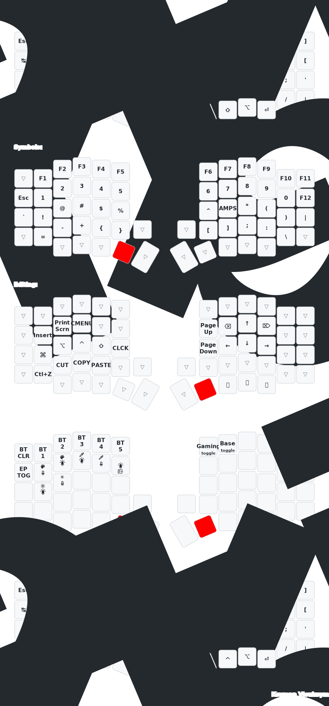

# PandaKB Sofle RGB MX ZMK Config

My ZMK configuration for the [PandaKB Sofle RGB MX](https://github.com/PandaKBLab/zmk-for-PandaKB/tree/PandaKB_Sofle) keyboard.

## Differences From Upstream PandaKB_Sofle

This comparison is based on `https://github.com/PandaKBLab/zmk-for-PandaKB/tree/PandaKB_Sofle`.

Main differences:

* The repository is focused on the dongle-less SSD1306 OLED version: `build.yaml` keeps `Sofle_L_oled`, `Sofle_R_oled`, and `settings_reset`.
* RGB turns off on idle and USB disconnect so the keyboard does not keep glowing after the host shuts down.
* Configuration files were cleaned up by removing outdated and unused values.
* The right encoder now works as a mouse wheel.
* The left encoder controls volume.
* The base layer is adapted to my personal layout.

## Keymap

## Prospector Dongle Variant

Alongside the standalone `Sofle_L`/`Sofle_R` build, this repo also builds a
[Prospector](https://github.com/carrefinho/prospector) dongle variant where
the dongle (Seeed XIAO nRF52840 + round LCD) is the BLE central and both
halves are peripherals with no OLED:

* `Sofle_dongle_L` / `Sofle_dongle_R` — flash to each half (`nice_nano_v2`).
* `Sofle_dongle_prospector` — flash to the Prospector dongle
  (`seeeduino_xiao_ble`); shows layer, battery, and connection status on
  its screen.
* A separate `settings_reset` build is provided for the dongle board so its
  BLE bonds can be reset independently of the halves.

After flashing, pair the **left half first, then the right half** — the
Prospector battery widget orders itself by pairing order.

Both build variants can coexist; you choose which firmware to flash per
device. `config/Sofle_dongle.keymap` is a symlink to `config/Sofle.keymap`,
so keymap edits apply to both automatically.
